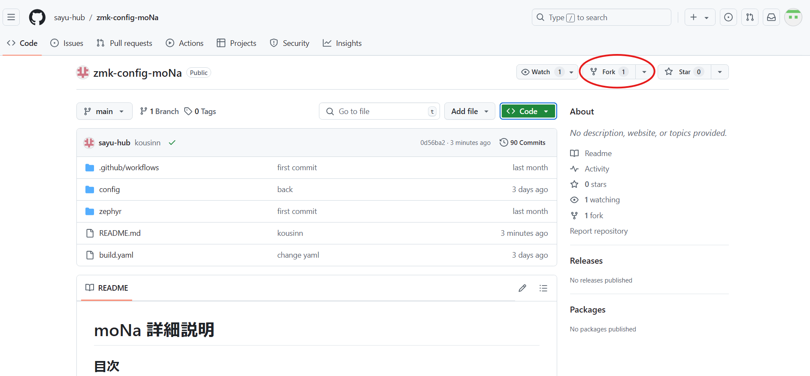
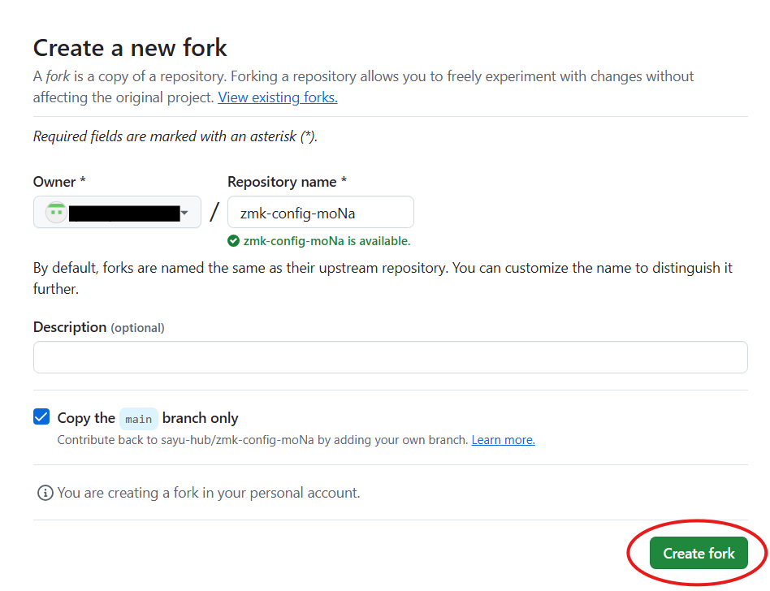
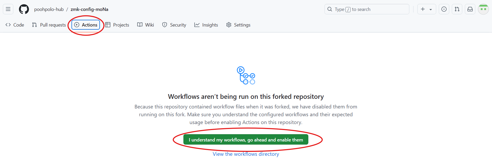
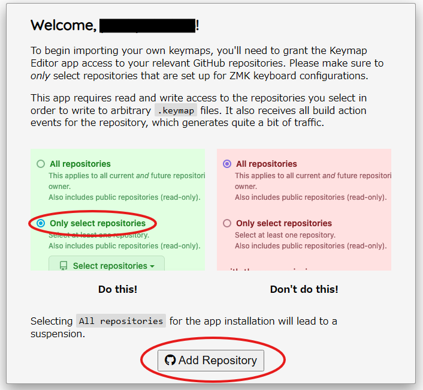
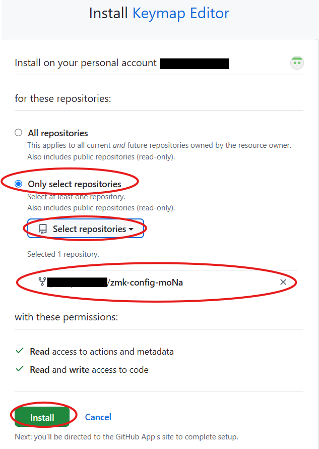

# moNa2 詳細説明

## 目次
  - [1. moNaについて](#1-monaについて)
    - [1-1. 性能紹介](#1-1-性能紹介)
    - [1-2. バージョン説明](#1-2-バージョン説明)
  - [2. 商品詳細](#2-商品詳細)
    - [2-1. 商品内容](#2-1-商品内容)
    - [2-2. 別途購入必要部品](#2-2別途購入必要部品)
    - [2-3. 購入おすすめ品](#2-3-購入おすすめ品)
    - [2-4. キーキャップについて](#2-4-キーキャップについて)
  - [3. 動作確認](#3-動作確認)
    - [3-1. 組み立て](#3-1-組み立て)
    - [3-2. PCとの接続方法](#3-2-pcとの接続方法)
    - [3-3. LEDの簡易表示について](#3-3-ledの簡易表示について)
  - [4. ファームウェアについて](#4-ファームウェアについて)
    - [4-1. キーマップの編集](#4-1-キーマップの編集)
    - [4-2. ファームウェアの書き込み方法](#4-2ファームウェアの書き込み方法)
  - [5. 修正等](#5-修正等)
    - [5-1.修正ログ](#5-1修正ログ)
    - [5-2.修正予定](#5-2修正予定)
  - [6. その他注意事項](#6-その他注意事項)
  - [7. Q&A](#7-qa)
  - [最後に](#最後に)
    - [自作キーボードに興味がある方へ](#自作キーボードに興味のある方)

## 1. moNaについて
仮写真

> キースイッチとキーキャップは付属しません

moNaは[kumakey](https://twitter.com/kumamuk_key)さんが制作したroBaを参考にしてできた分割型キーボードです。
kumakeyさんから販売許可は戴いております。

### 1-1. 性能紹介

* ロープロファイル
* 完全ワイヤレス
* 17mmキーピッチ
* ZMKfirmware採用
* ロータリーエンコーダつき(カスタム済み)
* 42キー
* LEDによるバッテリー残量、BLE接続状態の簡易表示
* バッテリー容量: 170mA  
> [!NOTE]
> ロープロファイルエンコーダを採用しているためエンコーダにはスイッチ機能はついていません

### 1-2. バージョン説明

#### moNa - 左手トラックボール版
>[moNa用ファームウェア](https://github.com/sayu-hub/zmk-config-moNa)
#### moNa2 - 右手トラックボール版
>[moNa2用ファームウェア](https://github.com/sayu-hub/zmk-config-moNa2)

> [!WARNING]
> 同じ商品でも修正等により、形状が多少変化する場合があります。

## 2. 商品詳細

#### 価格 --- 調整中 ---
#### 販売方法 --- 未定 ---

### 2-1. 商品内容

写真

* キーボード本体(左右)
* 説明書類

必要な**はんだ付けはすべて行った状態**での販売のため、はんだごて等の準備は必要ありません。

> [!CAUTION]
> この商品単体では動作しません下記の[別途購入必要部品](#2-2別途購入必要部品)を参照してください。

### 2-2.別途購入必要部品

1. キースイッチ(choc v2)
> おすすめ : lofree ghoast
2. キーキャップ(キーピッチ17mm要対応)  
17mm用キーキャップの3Dデータは [こちら](model/keycap/17mm_keycap.3mf) に公開しています。
> その他おすすめ : Junana MX
3. 精密ドライバー 
> 組み立ての際**m2ねじ**の取りつけ・取り外しに使用します

### 2-3. 購入おすすめ品

1. マグネットコネクタ
> usb-cにマグネットコネクタを使うことで取り回しの良さが向上します
2. ポロンシート
> ケースとPCBとの間に敷くことで打鍵感の向上が予想されます

### 2-4. キーキャップについて

shakupanさん作のキーキャップの3Dデータを公開しています。
3Dプリンタをお持ちの方は[こちら](model/keycap/17mm_keycap.3mf)からダウンロードして印刷してみてください。
印刷の際は側面を下にして印刷することで積層が縦になり手触りがとてもよくなります。
<!-- プリント写真 -->

 

3Dプリンタを持っていない方でもmoNaの購入時にオプションで付けることが可能となる予定です。  
あくまで3Dプリンタ製であるということをご理解いただいたうえでご購入してください。

## 3. 動作確認

### 3-1. 組み立て

1. トッププレートについているねじをすべて外し、トッププレートを外してください。
2. トッププレートの角にいくつかキースイッチをはめ込み、PCBに差し込みます。
3. ほかのキースイッチもすべてはめ込み、キーキャップを取り付けたら完成です。

### 3-2. PCとの接続方法
1. それぞれのマイコンのリセットボタンを1回押します。
2. PCでbluetoothデバイスとして「moNa」を選択します。

bluetooth接続が完了したらすべてのキーが認識するか、ロータリーエンコーダ、トラックボールが問題なく動作するか確認してください。
左右間のペアリングは電源を入れると自動的に行われます。
有線接続でも動作しますが、左右間は無線接続のみになります。
ロータリーエンコーダ側はPCに有線接続してもキーボードとして動作しません。

### 3-3. LEDの簡易表示について
左右のマイコンについているLEDで2つの状態を確認することができます。
#### バッテリー残量
* 起動時にバッテリー残量に応じて🟢/🟡/🔴で点滅（中央側・周辺側の両方で）
* 重要なバッテリー残量を下回ると🔴で点滅

#### Bluetooth接続状況
* bluetoothプロファイルの切り替え時、接続状態に応じて🔵/🟡/🔴で点滅

## 4. ファームウェアについて
それぞれの最新ファームウェアはこちら  
[moNa(左トラボ)用ファームウェア](https://github.com/sayu-hub/zmk-config-moNa)  
[moNa2(右トラボ)用ファームウェア](https://github.com/sayu-hub/zmk-config-moNa2)

### 4-1. キーマップの編集

冒頭で書いたようにzmk firmwareの編集にはgithubのアカウントが必要です。  
一からファームウェアを用意する際の手順は[公式ドキュメントの導入解説](https://zmk.dev/docs/user-setup)を見るとわかりやすいです。  
以下では、私が作成したリポジトリをフォークし、[KeymapEditor](https://nickcoutsos.github.io/keymap-editor/)を用いてGUIでキーマップを書き換える手順を紹介します。  

1. githubアカウントを作成し、ログインします。
2. [このリポジトリ](https://github.com/sayu-hub/zmk-config-moNa2)にアクセス
3. 画面右上の「Fork」をクリック

4. そのまま「Create fork」をクリック

5. フォークしたリポジトリの「Actions」タブに移動し、「I understand my workflows, go ahead and enable them」をクリックし、github Actionsを有効化

6. [KeymapEditor](https://nickcoutsos.github.io/keymap-editor/)にアクセス  
7. 「GitHub」を選択

8. 「Login with GitHub」からでログイン 
9. 「Only select repositories」を選択して「ADD Repository」を押す

10. 「Only select repositories」を選択し「Selectrepositories」から「zmk-config-moNa」を選択して「Install」を押す

11. Keymap Editor上でキーマップが表示されたら、好きにキーマップを編集する
12. 画面左上の「Save」を押すと、編集したキーマップが適用されてGitHub Actionsが走り、自動的にビルドが開始します

13. 「Save」の隣に表示される「Latest」をクリックするとGitHubに移動し、ビルドが完了するとファームウェアがダウンロードできるようになります。  
 (ビルドには2~4分かかる場合があります。)
14. [書込み手順](#4-2ファームウェアの書き込み方法)に従い、ファームウェアを書き込みます。  
    + キーマップの編集のみの場合はトラックボール側(セントラル)のみを書き換えることで変更が適用されます。  
    リセットファームウェアの書込みも基本的には必要ありません。
    + KeymapEditorを用いずにmoNa.keymap以外のファイルの内容を書き換えた場合は、左右のファームウェアを書き換えてください。  
    + ファームウェアを書き直した際は、PC側のペアリング情報も削除してから再度ペアリングを行ってください。
15. 無事に変更したキーマップが適用されていれば成功です。

### 4-2.ファームウェアの書き込み方法

1. PCと左側のマイコンをUSBで接続します。はじめはキーボードの電源はオフで大丈夫です。
2. マイコンのリセットボタンを2回押すと、「XIAO SENSE」という名前でUSBドライブとして認識されるかと思います。(ブートローダの起動)
3. 「XIAO SENSE」ドライブにsettings_reset-seeeduino_xiao_ble-zmk.uf2をドラッグアンドドロップします。  
4. 書込み完了すると、「XIAO SENSE」というドライブは消えますが、再度リセットボタンを2回押し、ブートローダを起動します。  
5. 「XIAO SENSE」ドライブにmoNa2_L rgbled_adapter-seeeduino_xiao_ble-zmk.uf2をドラッグアンドドロップします。  
6. 右側も同様の手順でsettings_reset-seeeduino_xiao_ble-zmk.uf2とmoNa2_R rgbled_adapter-seeeduino_xiao_ble-zmk.uf2を順番に書き込みます。
7. 両方の書込みが完了したら、電源を入れ、それぞれのマイコンのリセットボタンを**1回**押します。
8. PCでbluetoothデバイスとして「moNa2」が認識され接続できればOKです。  

## 5. 修正等

### 5-1.修正ログ
10.18 - ねじ穴位置修正(m2)
      - 左右形状の一致化
      - choc v2 v1 対応化
11.02 - moNa2 ファームウェア作成
      - 動作確認
      - moNa2 ケース制作 
11.09 - 独自キーキャップ製作

### 5-2.修正予定( やることリスト )

1. エンコーダ、マイコン周りの見直し
2. トラボ周りのアップデート
3. ケースのアップデート
4. 販売体制の整備
5. moNaアップデート
6. 通常ピッチ検討
7. 44型検討

## 6. その他注意事項

* リポバッテリーには発火等の危険性があります。あらかじめ承諾したうえで購入を検討してください。  
発生した事故については責任を負いかねます。
* 充電は満タンになると自動でストップします。
* ロープロエンコーダは回転を滑らかにするためにカスタムしています。ご理解の上ご購入ください。
* ケースは3DP製のため、ムラや積層痕が発生する場合があります。神経質な方は購入をご遠慮ください。
* 購入後のキャンセル等は受け付けておりません。
* 現在のカラー展開は**白と黒**の2色となっております。
* 上記以外で何か質問等があれば[Pooh.polo](https://twitter.com/Pooh_pol0)までDMしていただけると幸いです。
> 現在多忙なため返信が遅れる場合があります。

## 7. Q&A
 #### 充電の持ちはどのくらいですか？
  フル充電状態でトラボ側が約半月、反対側が約1ヵ月くらい持つと思います。
  充電は大体2時間程度で満タンになると思います。
 #### 在庫はいつ追加されますか？
  在庫復活は不定期となります。
  販売の際は[Twitter](https://twitter.com/Pooh_pol0)でお知らせします。

## 最後に
#### もしmoNaを気に入っていただけましたらX(旧Twitter)等で#moNaを付けて宣伝してもらえるとありがたいです！

### 自作キーボードに興味のある方
[Zenn]()
知識ゼロの自分がこのキーボードを完成させるまでの道のりを書いています。
自分だけの自作キーボードを作りたい！と思っている方、良ければ目を通してみてください！

[知識ゼロから完成までの自作キーボード制作過程](https://zenn.dev/pooh_polo/articles/3e381553974708)

> [!WARNING]
> 記事は随時更新します。
